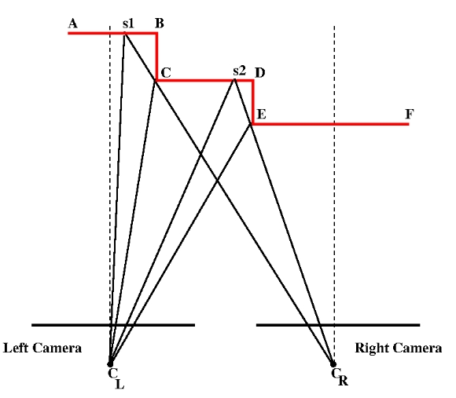

# 4. Evaluation

## 4.1. The results achieved

## 4.2. Compare with the results of the group on the same topic

## 4.3. Previous studies

### 4.3.1. Jumping Gaping pixels

Assume that the image produced by the left image is the *reference image*. Futhermore, two images have been rectified, so that each row is the epipolar line for the pixels in the same row in the other image.

One portion of the scene
may obscure other portions in either or both of the two cameras. 

The scene points in the triangle $B-C-s1$ are not visible to the reference (left) camera. Thus we will have a sudden jump in the disparity map when we go from the 
reference-image pixel for point $B$ in the scene to the next pixel that would correspond to point $s_1$ in the scene.

What if the similar phenomenon happens to the right camera?

While the overall conclusion is the same for the previous 
example and the current one, there is one very important difference: Now there will be gaps in the pixels in the reference image where there will be no disparities. For example, $s_1-B-C$ will have no disparities.

