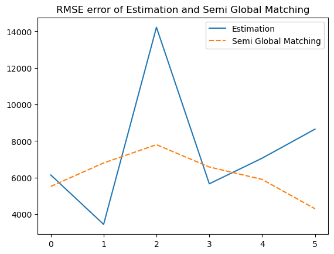

# 2. Mathematical background

## 1. Epipolar Geometry
Epipolar geometry is the geometry of stereo vision. When two cameras view a 3D scene from two distinct positions, there are a number of geometric relations between the 3D points and their projections onto the 2D images that lead to constraints between the image points. These relations are derived based on the assumption that the cameras can be approximated by the pinhole camera model.

### 1.1. Definition
The figure below depicts two pinhole cameras looking at point X. In real cameras, the image plane is actually behind the focal center. 
However, we simplified the problem by placing a *virtual* image plane in front of the camera, since real plane is symmetric about the focal center of the lens.

Each camera captures a 2D image of the 3D world. This conversion from 3D to 2D is referred to as a perspective projection and is described by the pinhole camera model.

### 1.2. Epipole or epipolar point

Each center projects onto a distinct point into the other camera's image plane. These two image points, denoted by $e_L$ and $e_R$, are called epipoles or epipolar points.

Epipolar point is the intersection of line connecting two camera's center $O_L$ and $O_R$ with their image plane.

### 1.3. Epipolar line
    
Line $O_L-X$ projected on right camera creating a line $e_R-X_R$ called the epipolar line.
Symmetrically, the line $O_R-X$ is seen by the right camera as a point and is seen as epipolar line $e_L-x_L$ by the left camera.

The red lines are epipolar lines

When two image planes are parallel then the epipoles $e$ and $e'$ are located at infinity. 
Then the epipolar lines are parallel to $x$ axis of image.

### 1.4. Epipolar plane
$X, O_L, O_R$ form a plane, called epipolar plane. The epipolar plane and all epipolar lines intersect the epipoles regardless of where $X$ is located.

### 1.5. Epipolar constraint

If the relative position of the two cameras is known, this leads to two important observations:

Assume the projection point $x_L$, the epipolar line $e_R-x_R$ and the point $X$ projects into the right image is known. A point $x_R$ which must lie on this particular epipolar line.

This provides an epipolar constraint: the projection of $X$ on the right camera plane xR must be contained in the $e_R-x_R$ epipolar line. All points $X$ e.g. $X_1, X_2, X_3$ on the $O_L–X_L$ line will verify that constraint. 

Epipolar constraints can also be described by the essential matrix or the fundamental matrix between the two cameras.

### 1.6. Disparity and Depth map

The above diagram contains equivalent triangles. Writing their equivalent equations will yield us following result:

$$
\text{disparity}=x-x'=\frac{Bf}{Z}
$$
So the depth $Z$ would be:
$$
\text{depth}=\frac{x-x'}{Bf}
$$

Where:

- $x$ and $x'$ are the distance between image points and their corresponding camera center.

- $B$ is the baseline, distance between two camera center.

- $f$ is the focal of both camera (they should have the same).

So in short, the above equation says that the depth of a point in a scene is inversely proportional to the difference in distance of corresponding image points and their camera centers.

## 2. Essential matrix

### 2.1. Coordinate representation
This derivation follows the paper by Longuet-Higgins.

For simplicity, we assume all the cameras are **normalized** and project the 3D world onto their respective image planes. i.e $K = K' = I$.

Let the 3D coordinates of a point **P** be $(x_1,x_2,x_3)$ and $(x'_{1},x'_{2},x'_{3})$ relative to each cmera's coordinate system. 

The mapping from the coordinates of a 3D point P to the 2D image coordinates of the point's projection onto the image plane, according to the pinhole camera model, is given by:

$$
\left(\begin{array}{cc} 
y_1\\
y_2\\
1
\end{array}\right)
=
\frac{1}{x_3}
\left(\begin{array}{cc} 
x_1\\ 
x_2\\
x_3
\end{array}\right)
\quad \text{and} \quad
\left(\begin{array}{cc} 
y'_1\\
y'_2\\
1
\end{array}\right)
=
\frac{1}{x_3}
\left(\begin{array}{cc} 
x'_1\\ 
x'_2\\
x'_3
\end{array}\right)
$$ 

More compactly as:

$$
\begin{align}
y = \frac{1}{x_3} {x} \quad \text{and} \quad y' = \frac{1}{x_3}{x} 
\end{align}
$$
 
Where $y$ are the image 2D coordinate, $x$ are real life 3D cooordinates.

### 2.2. Set up camera framework

Let further assume world reference coordinate is associated with the first camera with the second camera offset by a $3\times3$ rotaion matrix $R$  and 3 dimensional translation matrix $t$. This implies:

$$
\begin{align}
\vec{x'} = R({x} - t)
\end{align}
$$

So the camera matrix will be:

$$
\begin{align}
M = P[I & 0] \quad \text{and} \quad M' = P'[R^T & R^T-t]' 
\end{align}
$$

Or (because of cameras are normalized): 

$$
\begin{align}
M = [I & 0] \quad \text{and} \quad M' = [R^T & R^T-t]' 
\end{align}
$$

### 2.3. Essential matrix derivation

Since the vector $x = R(x'-T)$ and $t$ lie in the same epipolar line, then their cross product would produce a vector normal to the epipolar plane:

$$
\begin {align}
{x}.[t \times (R{x}')]=0
\end {align}
$$

**Reminder from linear algebra:**
The cross product between any two vectors a and b as a matrix-vector multiplication:
$$
\begin {align}
a \times b =
\left(\begin{array}{cc} 
0 & -a_z & a_y\\ 
a_z & 0 & -a_x \\
-a_y & a_x & 0
\end{array}\right)
\left(\begin{array}{cc} 
b_x\\ 
b_y\\
b_z
\end{array}\right) =
[a_\times]b
\end {align}
$$

Combining this expression with Equation 6, we can convert the cross
product term into matrix multiplication, giving:

$$
x^T.[t_\times](Rx')=0  
$$

$$
\begin {align}
x^T[t_\times]Rx'=0
\end {align}
$$

Then, the **Essential Matrix** is $E = [t\times]R$ creating a com-
pact expression for the epipolar constraint:
$$
\begin {align}
x^TEx'=0
\end {align}
$$

The Essential matrix is a 3 × 3 matrix that contains 5 degrees of freedom. It has rank 2 and is singular.

### 2.4. Essential matrix mapping

Different to a homography which maps a point to a point, an essential matrix maps a **point** to a **line**.
Furthermore, let's consider an epipolar line $l$, with the form of $ax+by+c=0$, or in vector form:

$$
\begin{aligned}
l=
\left(\begin{array}{c} 
a\\
b\\
c
\end{array}\right) \quad \text{and} \quad x^T l=0
\end{aligned}
$$

Then it is easy to see that, from Equation 8:

$$
\begin{align}
l=Ex' \quad \text{and} \quad l'=E^Tx
\end{align}
$$

### 2.5. Essential matrix kernel
Since every lines on image plane pass epipolar. So $e^Tl=0$, combine with Equation 9, we have $e^Tl=0=e^TEx'$. Furthermore, $e^TE=(E^Te)^T=l'^T$ thus is normal with $x'$. 

In short, essential kernel defines the epipole:
$$
\begin {align}
e^TE=0 & and & Ee'=0
\end {align}
$$
(points in normalized camera coordinates)

## 3. Fundamental matrix
### 3.1. Camera matrix
How do you generalize to uncalibrated cameras? Recall the Equation 3:
$$
\begin{align}
M = K[I & 0] & and & M' = K'[R^T & R^T-t]' 
\end{align}
$$
First, we must definde $X_W$ is a point from 3d world. We get two projected point on cameras:

$$
\begin {aligned}
X_0=P X_W\\
X_0'=P'X_W
\end {aligned}
$$

Say we have canonical cameras transform space by a general homography matrix $H = I$, 
then we have projections of $X_W$ to the corresponding camera images.

$$
\begin {aligned}
x = K^-1 X_W\\
x'=K^-1'X_W'
\end {aligned}
$$

### 3.2. Fundamental matrix derivation
Recall that in the canonical case from Equation 7:
$$
\begin {align}
x^T[t_\times]Rx'=0
\end {align}
$$

By substituting in the values of $x$ and $x'$, we get:
$$
\begin {align}
x^T K^{-T}  [t_\times] R K'^{-1} x' =0
\end {align}
$$

Let the matrix $F = K^{-T}  [t_\times] R K'^{-1}$ as the **Fundamental Matrix** which acts the same to the Essential matrix from previous but also encondes information about the camera matrices $K$ and $K'$ and the relative translation T and rotation R between the cameras.

Therefore, it is also useful in computing the epipolar lines associated with p and p′, even when the camera matrices K, K′ and the transformation R, T are unknown.

### 3.3. Propertises of fundamental matrix

Similar to the Essential matrix, we can compute the epipolar lines $l'=F^T x$ and $l=Fx'$ from just the fundamental matrix and the corresponding points.

Fundamental matrix contains 7 degrees of freedom, while Essential matrix’s 5 degrees of freedom.

If we know the fundamental matrix, then simply knowing a point in an image
gives us an easy constraint (the epipolar line) of the corresponding point in the other image. Therefore, without knowing the actual position of $X_W$ in 3D space, or any of the extrinsic or intrinsic characteristics of the cameras, we can establish a relationship between any $x$ and $x'$.

## 4. The Eight-Point algorithm
### 4.1. Formulating a homogeneous linear equation

With each correspondent $x$ and $x'$

$$\begin{aligned}
x=
\left(\begin{array}{cc} 
x_1\\ 
x_2\\
1
\end{array}\right)
\quad \text{and} \quad
x'=
\left(\begin{array}{cc} 
x'_1\\ 
x'_2\\
1
\end{array}\right)
F = 
\left(\begin{array}{cc} 
f_{11} & f_{12} & f_{13}\\
f_{21} & f_{22} & f_{23}\\
f_{31} & f_{32} & f_{33}
\end{array}\right)
\end{aligned}$$

The constraint can be rewritten as:

$$\left(\begin{array}{cc} 
x'_1x_1 & x'_1x_2 & x'_1 &
x'_2x_1 & x'_2x_2 & x'_2 &
x_1 & x_2 & 1
\end{array}\right)
\begin {aligned}
\left(\begin{array}{cc} 
f_{11} \\ f_{12} \\ f_{13}\\
f_{21} \\ f_{22} \\ f_{23}\\
f_{31} \\ f_{32} \\ f_{33}
\end{array}\right)
=0
\end {aligned}$$

That is $f$ represents the flatten **Fundamental matrix** vector and 
this vector must be othorgonal to vector $\mathbf{\bar{x}} = x'x^T$.

Each pair of corresponding image points produces a vector $\mathbf{\bar{x}}$. 
Given a set of 3D points $\mathbf{X_W}$ corresponding to a set of vector $\mathbf{\bar{x}}$ 
and all of them must satisfy:

$$
\mathbf{\bar{x}} \cdot f = 0
$$

Collect $N$ vector $\mathbf{\bar{x}}$ as the row of matrix $\mathbf{X}$ and:
$$
Xf=0
$$

Where $\mathbf{X}$ is a $N \times 9$ matrix with $N \ge 8$.

### 4.2. Solving the equation
In pracitce, there are noise so solution vector f is defined only up to an unknown scale.
So it is better to use more than eight correspondences and create a larger $X$. 
Furthermore, $X$ is often rank-deficient, so we approximate $f$ by **Linear least squares**:

$$
\begin{align}
\begin {split}
    \min_f & \quad \lVert Xf\rVert \\
    \text{subject to} & \quad \lVert f\rVert =1
\end{split}
\end{align} 
$$

The subject is to avoid the trivial solution f.

The solution to this optimize problem can be found by Singular Value Decomposition (SVD).
$f$ is the right singular vector corresponding to the smallest singular value of $X$. A reshape
of this $f$ into $3 \times 3$ matrix give result called as $\mathbf{F_{est}}$.

### 4.3. Enforcing the internal constraint
An important property of the fundamental matrix is that it is singular, in fact of rank 2. 
Furthermore, the left and right null spaces ($e$ and $e'$) of $F$ are generated by the vectors representing the two epipoles in the images i.e $dim Null(F) = 1$. 
However, often, dealing with noisy image gives the result $\mathbf{F_{est}}$ from Equation 14 usually does not have rank 2.

We find a best rank-2 matrix approximation of F by the mean of:
$$
\begin{align}
    \begin{split}
    \min_F & \quad \lVert F_{est} - F\rVert \\
    \text{subject to} & \quad \det F =0
    \end {split}
\end{align} 
$$
The constrain is to make $F$ is singular.

This problem is solved again by SVD, where $F = U\Sigma V^T $ then the best rank-2 approximation is found by:

$$
F = U
\begin{bmatrix}
\Sigma_1 & 0 & 0 \\
0 & \Sigma_2 & 0 \\
0 & 0 & 0 
\end{bmatrix}
V^T 
$$

### 4.4. Normalized algorithm
#### 4.4.1. Problems

The problem of the standard algorithm is that $X$ is often ill-conditioned for SVD. For SVD to work properly, $X$ shuld have one singular value equal or near to zero, with the rest are non zero.

However, correspondences coordinate $(x,y,1)$ will often have
extremely large values in the first and second compared to the third $(\bar{x}=(1920,1080,1))$ due to large pixel range of mordern digital camera.

Furthermore, if the image points used to construct $X$ lie in a relatively small region of the image $((700,700)\pm100)$, then $x$ and $x'$ are relatively similar, resulting in $X$ has one ery large singular value, with the rest relatively small.

#### 4.4.2. Solution
To solve this, map each coordinate system of two images independently into a new system satisfying two conditions:

- The origin of the new system should be at the centroid (center of gravity) of the image points. This is accomplished by translating original origin to new one.

- After the translation, the coordinates have to be uniformed so that the mean of distance from each points to the origin equals $\sqrt 2$. This can e done by the scaling factor for each respective image

$$
\displaystyle \sqrt \frac{2N}{\displaystyle \sum_{i=1}^N \lVert x_i-\mu \rVert^2}
$$

Afterwards, a distinct coordinate transformation for each of the two images. We obtain a new homogeneous image:
$$
\begin {align*}
\bar x = Tx \\
\bar x'= T'x'
\end{align*}
$$

This normalization is only dependent on the image points which are used in a single image and is, in general, distinct from normalized image coordinates produced by a normalized camera.

Note that we overload the notations because of the obivious relations.

The epipolar constraint based on the fundamental matrix can now be rewritten as:

$$
x^TFx' =\bar x'^T T'^{-T} F T^{-1} T \bar x = \bar x'^T \bar F \bar x = 0
$$

Where $\bar F = T'^{-T} F T^{-1} T$. 

This means that it is possible to use the normalized homogeneous image coordinates, $\bar x$ and $\bar x'$, 
to estimate the transformed fundamental matrix $\bar F$ using the basic eight-point algorithm described above.

The solution $\bar F$ is now more well-defined from the homogeneous equation $\bar X \bar F$ than $F$ is relative to $X$.
Once $\bar F$ has been determined, we can de-normalized to give $F$ by:
$$
F = T'^T\bar FT
$$

## 5. Image Rectification
### 5.1. Parallel image planes

Recall that when two image planes are parallel then the epipoles $e$ and $e'$ are located at infinity and the epipolar lines are parallel to the $x$ axis of image.
We can assume that the two cameras has the same intrinsic $K$ and there is no rotation between them $R=I$.
Furthermore, we assume there is only a translation along the $x$ axis $T=(T_x,0,0)$.
Then the essential matrix would be:

$$\begin{align}
E_{rect}=[T_\times] R =
T_\times
\left(
\begin{array}{cc}
0 & 0 & 0 \\
0 & 0 & -1 \\
0 & 1 & 0
\end{array}\right)
\end {align}$$

Once $E$ is known, we can find the directions of the epipolar line $l$ associated with point $x'$ in the second image plane:

$$\begin{align*}
l = Ex'=
\left(\begin{array}{cc}
0 & 0 & 0 \\
0 & 0 & -T_\times \\
0 & T_\times & 0 
\end{array}\right)
\left(\begin{array}{cc}
x'_1 \\
x'_2 \\
1
\end{array}\right)
=
\left(\begin{array}{cc}
0 \\
-T_\times\\
T_\times x'_2
\end{array}\right)
\end {align*}$$

We can see that epipolar line $l$ horizontal, parallel to the $x$ axis. 
As is the direction of $l$, which is computed in the same manner.

Furthermore, if we use the epipolar constraint $x^TEx'=0$, 
then we arrive the fact that $x_2=x'_2$, which is very handy in indentifying correspondences.
Therefore **rectification** makes any two given images become parallel, 
becomes useful then discerning the relationship between corresponding points in images. 

### 5.2. Rectification Setup:

We compute two homographies $H_1$ and $H_2$ that apply to the image planes to make the resulting planes parallel.

Rectifying a pair of images does not require knowledge of camera intrinsic
$K$ and $K'$, or the transformation matrix $R,T$. 
Instead, we can use the Fundamental matrix estimated by the Normalized 
Eight Point algorithm. Upon getting the Fundamental matrix, we can compute the epipolar lines $l_i$ and $l_i'$ for each correspondence and $x_i'$ and $x_i$.

From the set of epipolar lines, we can then estimate the epipoles $e$ and $e'$ of each image. This is because epipole lies in the intersection of all the epipolar lines. 
In pratice, due to noises, all the epipolar lines will not intersect in a single point. Therefore, epipole esstimated by minimizing the least squared error of fitting a point to all the epipolar lines.
Recall that a line is defined by $\{ x \mid l^T x = 0 \}$:

$$
\left(\begin{array}{cc}
l^T_1 \\ 
l^T_2 \\ 
\vdots \\ 
l^T_n \end{array}\right) 
e = 0
$$

We can use SVD to find $e$. $e$ is the smallest eigenvector of $L$.

Generally, the solution epipoles $e$ and $e'$ are not at infinity along the horizontal $x$ axis. If they were, by definition, the images have already been parallel.
Thus we gain some insight to make the images parallel: find a homography to map epipole $e$ to infinity along the $x$ axis. 

Specifically, this means that we want to find a pair of homographies H1, H2 that we can apply to the images to map the epipoles to infinity. We map the second epipole $e'$ to a point at infinity on the horizontal axis. One condition that leads to good results in practice is to insist that the homography acts like a transformation that applies a 
translation and rotation on points near the center of the image.

### 5.3. Sending epipoles to infinity

First, we translate the second image so its center is at $(0, 0, 1)$ in homogeneous coordinates using the translation matrix $T$:

$$
T = \left(\begin{array}{cc}
1 & 0 & -\text{width}/2 \\
0 & 1 & -\text{height}/2 \\
0 & 0 & 1
\end{array}\right) 
$$

After translation, we apply a rotation to place the epipole on the the horizontal axis at some point $(f, 0, 1)$.
If the translated epipole $Te'$ is located at homogeneous coordinates $(e_1, e_2, 1)$, 
then the rotation applied is:

$$
R = \left(\begin{array}{cc}
\alpha\frac{e'_1}{\sqrt{e_1'^2 + e_2'^2}} & \alpha\frac{e'_2}{\sqrt{e_1'^2 + e_2'^2}} & 0 \\
-\alpha\frac{e'_2}{\sqrt{e_1'^2 + e_2'^2}} & \alpha\frac{e'_1}{\sqrt{e_1'^2 + e_2'^2}} & 0 \\
0 & 0 & 1
\end{array}\right) 
$$

Where $\alpha = 1$ if $e'_1 \geq 0$ and $\alpha = -1$ otherwise. 

After applying this rotation, bringing any point at $(f, 0, 1)$ to a point at infinity on the horizontal axis $(f, 0, 0)$ requires applying the transformation:

$$
G = \left(\begin{array}{cc}
1 & 0 & 0 \\
0 & 1 & 0 \\
\frac{1}{f} & 0 & 1 
\end{array}\right) 
$$

After applying this transformation, we finally have an epipole at infinity, so we can translate back to the regular image space. Thus, the homography $H_2$ that we apply on the second image to rectify it is:

$$H_2 = T^{-1}GRT$$

Now that a valid $H_2$ is found, we need to find a matching homography $H_1$ for the first image. We do so by finding a transformation $H_1$ that minimizes the sum of square distances between the corresponding points of the images:

$$\underset{H_i}{\text{argmax}}{\sum_{i} \lVert H_i x_i - H'_i x'_i  \rVert^2}$$

## 6. Camera Pose

### 6.1. Estimate Camera Pose from Essential Matrix

The camera pose consists of 6 degrees-of-freedom (DOF): Rotation (Roll, Pitch, Yaw) and Translation $(X, Y, Z)$ of the camera with respect to the world. Since the E matrix is identified, the four camera pose configurations $(C_1, R_1), (C_2, R_2), (C_3, R_3), (C_4, R_4)$ where $C \in \mathbb{R}^3$ is the camera center and $R \in SO(3)$ is the rotation matrix, can be computed. Thus, the camera pose can be written as:
$P = K [R | t]$
where $K$ is the intrinsic parameter matrix.

Four pose configurations can be computed from the E matrix. Let $E = UDV^T$ and 
$W = \left(\begin{array}{cc}0 & -1 & 0 \\ 1 & 0 & 0 \\ 0 & 0 & 1\end{array}\right)$.

The four configurations are:

- $C_1 = U(:, 3)$ and $R_1 = UWV^T$

- $C_2 = -U(:, 3)$ and $R_2 = UWV^T$

- $C_3 = U(:, 3)$ and $R_3 = UW^TV^T$

- $C_4 = -U(:, 3)$ and $R_4 = UW^TV^T$

### 6.2. Check for Chirality Condition using Triangulation

In the previous section, we computed four different possible camera poses for a pair of images using the essential matrix. To find the correct unique camera pose, we need to remove the ambiguity. This can be accomplished by checking **the chirality condition**, i.e., **the reconstructed points must be in front of the cameras**.

To check the chirality condition, triangulate the 3D points (given two camera poses) using linear least squares to check the sign of depth $Z$ in the camera coordinate system with respect to the camera center. 

A 3D point $X$ is in front of a camera if it satisfies $r_3 (X - C) > 0$, where $r_3$ is the third row of the rotation matrix (z-axis of the camera). Not all triangulated points satisfy this condition due to the presence of correspondence noise. The best camera configuration $(C, R, X)$ is the one that produces the maximum number of points satisfying the chirality condition.

# 3. Solution

Most of the algorithm used in our codes are described above.

## 3.1. calibration.py

In this file, we compute the feature points, then estimate the fundamental and essential matrix from them. Furthermore, we find the correct camera pose (Rotation and Translation) from the $E$ matrix.

### 3.1.1. def draw_keypoints_and_match(img1: MatLike, img2: MatLike, nfeatures: int = 500) -> Tuple[NDArray, NDArray, MatLike]: ...

Finding keypoints using ORB feature detection and descriptors in the image and find best matches using brute force based matcher.

### 3.1.2. def compute_Fundamental_matrix(kp1_list: NDArray, kp2_list: NDArray) -> NDArray: ...

Calculate the $F$ matrix from a set of 8 points using SVD.
Furthermore, the rank of $F$ matrix is reduced from 3 to 2 to make the epilines converge.

More details at section [8 points algorithm](#42-solving-the-equation)

### 3.1.3. def RANSAC_F_mat(kp1_list: NDArray, kp2_list: NDArray, max_inliers=20, threshold=0.05, max_iter=1000) -> NDArray: ...

Shortlist the best F matrix using RANSAC based on the number of inliers.

RANSAC randomize 8 feature points to compute $F$ and calculate errors in estimating the points. Then we classify inliers with predefined threshold. Best $F$ is one with the most inliers.

### 3.1.4. def compute_Essential_matrix(F_mat: NDArray, K1: NDArray, K2: NDArray) -> NDArray: ...

Calculation of the Essential matrix with $F$, $K_1$ and $K_2$ camera intrinsic.

More details at section [Essential-matrix](#2-essential-matrix)

### 3.1.5. def get_camerapose(E_mat: NDArray) -> list[list[NDArray]]: ...

Extracts all the camera pose solutions from the E matrix.

More details at section [Camera Pose](#6-camera-pose)

### 3.1.6 def disambiguate_camerapose(camera_pose: list[list[NDArray]], list_kp1: NDArray): ...

Find the correct camera pose based on the chirelity condition from all 4 solutions.

More details at section [Camera Pose](#6-camera-pose)

### 3.1.7. def drawlines(img1src: MatLike, img2src: MatLike, lines, pts1src, pts2src, random_seed=0) -> tuple[MatLike, MatLike]: ...

Visualize the epilines on both the images

## 3.2. correspondence.py

### 3.2.1. def sum_of_squared_diff(pixel_vals_1, pixel_vals_2):

We use SSD formular:

$$\text{SSD} = \displaystyle{\sum_{i,j} {(I_1(i,j)- I_2(i,j))^2}}
$$

### 3.2.2. def block_comparison(y, x, block_left, right_array, block_size, x_search_block_size, y_search_block_size):

Block comparison function to find minimum SSD match.
Two image block are correspodence if their SSD is the minimum.

### 3.2.3. def ssd_correspondence(img1, img2):

Correspondence applied on the whole image to compute the disparity map and finally disparity map is scaled by min max scaling.

## 3.3. depth.py

### 3.3.1. def disparity_to_depth(baseline, f, img):

$$\text{depth} = \frac{Bf}{x-x'}$$

More details at section [Depth Map](#16-disparity-and-depth-map) 

## 3.4. rectification.py

### 3.4.1. def rectification(img1, img2, pts1, pts2, F):

Rectify the images to make camera pose's parallel and thus make epiplines as horizontal.
Since camera distortion parameters are not given we will use cv2.stereoRectifyUncalibrated(), instead of stereoRectify().

# 4. Evaluation

## 4.1. The results achieved

## 4.2. Compare with the results of the group on the same topic

## 4.3. Previous studies

### 4.3.1. Calculating correspondences (SGM)

We used Sum of Squared Differences (SSD) to calculate the coressponding block.
Howvever, this function inherently assume there is no sudden depth variations and occlusions. Furthermore, this assume continuous or functionally variable disparities within the correlation window. Thus often produce very noisy results, jumping and gap pixels.

One portion of the scene
may obscure other portions in either or both of the two cameras. Ex: $B-C-s_1$.

The Semi-Global Matching (SGM) implements Mutual Information cost function. The pixelwise cost and the smoothness constraints are expressed by defining the energy E(D) that depends on the disparity 
image D:

$$\displaystyle {E(D) = \sum_{p} \left( C(p, D_{p}) + \sum_{q \in N_{p}} P_{1} T[|D_{p} - D_{q}| = 1] + \sum_{q \in N_{p}} P_{2} T[|D_{p} - D_{q}| > 1] \right)}$$

Where:

- $D$ represents the disparity map.

- $C(p, D_p)$ is the data term that measures the fidelity of the disparity map $D$ at pixel $p$.

- $N_p$ denotes the neighborhood of pixel $p$.

- $T$ is an indicator function.

- First term is the similarity cost, the sum of all pixel matching costs for the disparities of $D$.

- $P_1$ penalty for small disparity changes  (1 pixel).

- $P_2$ penalty is constant and larger for all larger disparity changes.

Using a lower penalty for small changes permits an adaptation to slanted or curved surfaces. The constant penalty for all larger changes (i.e. independent of their size) preserves discontinuities. While SSD is too simple to capture these characters.

Its module is available at *cv2.StereoBM_create*

### 4.3.2. Disaprity post Filtering (WSL)

Since Weighted Least Squares (WSL) - based Fast Global Image smoothing mathemetical background as well as its algorithm is outside of our scope. We will not include it here.

Its objective is to enhance the quality of the input low-resolution depth map by increasing its spatial resolution. Low-resolution depth map and its associated
high-resolution color image are used as inputs. 

Its module is available at *cv2.ximgproc.createDisparityWLSFilter*

### 4.3.3. Deep Learning Based Approach

Deep learning

# References

https://web.stanford.edu/class/cs231a/course_notes/03-epipolar-geometry.pdf
https://cmsc426.github.io/sfm/#essential
https://en.wikipedia.org/wiki/Epipolar_geometry
https://en.wikipedia.org/wiki/Essential_matrix
https://en.wikipedia.org/wiki/Fundamental_matrix_(computer_vision)

For 4. Evaluation

https://core.ac.uk/download/pdf/11134866.pdf
https://engineering.purdue.edu/kak/Tutorials/SemiGlobalMatching.pdf

WSL Filter:
https://publish.illinois.edu/visual-modeling-and-analytics/files/2014/10/FGS-TIP.pdf